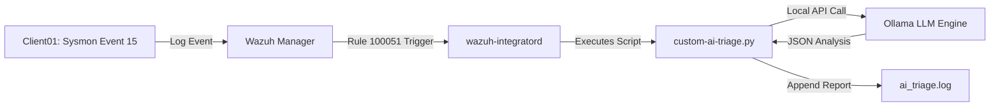

# Local AI Incident Response Triage Engine (Wazuh + Ollama)

An event-driven, privacy-preserving SIEM triage engine that automatically enriches high-risk endpoint security alerts using a locally hosted LLM (Ollama). 

This project bridges the gap between threat detection and automated response by converting raw JSON alert payloads into concise, actionable risk summaries for SOC analysts without exposing sensitive telemetry to external cloud APIs.

---

## 🏗️ Architecture Flow

Endpoint Event: Sysmon captures Event 15 (Alternate Data Stream creation) on a target host.

Rule Matching: Wazuh Manager processes the log and triggers custom Rule 100051.

Automated Dispatch: wazuh-integratord calls the custom Python integration script.

Local LLM Inference: The script parses alert context and queries a local Ollama model via REST API (http://localhost:11434/api/generate).

Triage Logging: Incident response analysis streams directly to /var/ossec/logs/ai_triage.log

Key Features:

Zero-Cloud Data Privacy: Operates 100% on-premise to ensure sensitive corporate hostnames, file paths, and logs never leave the internal network.

Low-Latency SOC Enrichment: Leverages lightweight local LLMs (llama3 / mistral) to evaluate threat context within seconds.

Standard-Library Python: Written without external Python library dependencies (requests, etc.) for seamless execution under unprivileged system users (wazuh).

AI Analysis:

